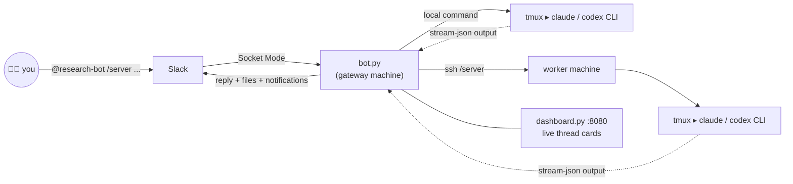

<div align="center">

# 🔬 research-bot

### Message your Slack bot. **Research anywhere, anytime.**

Drive [Claude Code](https://claude.com/claude-code) or [OpenAI Codex](https://github.com/openai/codex) on your own machines — straight from Slack.

[](LICENSE)
[](https://www.python.org/)
[](https://slack.dev/bolt-python/)
[](https://github.com/Minyoung1005/research-bot/pulls)

</div>

| 📱 **From your pocket** | 🖥️ **On your hardware** | 🔔 **Zero babysitting** |
|:---:|:---:|:---:|
| Launch experiments from the bus, the couch, the conference hallway | Agents run on *your* GPUs and workstations — no cloud runner, no data leaving your lab | Long jobs run in tmux and ping the thread back the moment they finish |

Mention the bot in a channel, and it runs Claude Code or the Codex CLI headlessly on your workstation, streams the result back into the thread, and remembers the conversation. Switch agents per message with `--model` — each keeps its own resumable per-thread session. Kick off a training run from your phone, get pinged when it finishes, and ask follow-up questions in the same thread — the session context carries over.

```
You    │ @research-bot plot the training curves from last night's run
Bot    │ 👀  ⏳ `server` running...
       │ ✅ `server` done!
       │ Loss curves attached — validation plateaus at epoch 40. [loss.png]
You    │ @research-bot rerun with lr=3e-4 and ping me when it's done
Bot    │ ✅ Launched in tmux session `training`. I'll notify this thread.
       │ ... hours later ...
       │ 🖥️ server: ✅ done — final val acc 91.2%
```

## Why not the official @Claude Slack app?

Use it if you can! But many workspaces — especially enterprise ones — **don't allow installing third-party Slack apps**, so the official [Claude for Slack](https://code.claude.com/docs/en/slack) integration is often simply unavailable. research-bot sidesteps that:

- **It's your own custom app**, created from a [one-page manifest](slack-app-manifest.yaml) under your workspace — custom internal apps are typically permitted where marketplace installs aren't (and worst case, a free Slack workspace for your lab takes two minutes).
- **Your tokens, your machines** — the bot talks to Slack over Socket Mode from a machine you own; nothing is installed from a vendor, and no code or data leaves your hardware.
- **It does things the official app can't** — SSH-route commands across all your GPU machines, launch training runs in tmux, ping you back hours later, and run Codex as easily as Claude.

## How it works



One machine runs `bot.py` as the **gateway** (receives Slack events over Socket Mode — no public URL or inbound ports needed). Commands either run locally or are routed over SSH to **worker** machines. Every run happens inside a dedicated tmux session, so you can always attach and watch.

## Features

- 🧵 **Thread = session** — each Slack thread maps to a persistent Claude Code session (`--resume`), per machine. Follow-ups keep full context.
- 🖥️ **Multi-machine routing** — `/server <command>` targets a specific machine over SSH; `/all` broadcasts to every machine.
- 🤖 **Agent-agnostic** — first-class support for both Claude Code and the Codex CLI: `--model claude/sonnet`, `--model codex/gpt-4.1`, `--effort high` per command. Both runners get per-thread session resume, and the `MODELS` registry in `bot.py` makes new CLI agents easy to add.
- 📊 **Live dashboard: cards you can chat with** — `dashboard.py` serves per-thread status cards (running / idle / ended, todos, live output tail, End button). Click a card and it opens as a chat: full conversation history plus a message box — what you type is posted into the Slack thread and run by the bot, so both surfaces stay in sync. Includes a ⚙ settings page for `.env` (secrets masked), `STYLE.md`, and recipes. Chat + settings are localhost-only.
- 💪 **Crash-safe** — in-flight runs are journaled; if the bot restarts mid-run, it re-attaches to the tmux output and still delivers the result.
- 🧠 **Two-layer memory** — per-channel context files auto-updated after every command (git-synced across machines), plus a SQLite FTS5 full-text history you can query with `/history <query>`.
- 📎 **File attachments, with a token budget** — drop files into Slack; they're downloaded and `scp`'d to the target machine so the agent can use them. `ATTACHMENT_MODE=text` (or `--attachments text` per message) keeps token-hungry media — images, video, documents, zips — out of the agent's context entirely.
- 🔔 **Long-job notifications** — the agent is instructed to launch long tasks (training, evals) in background tmux and ping the exact channel + thread via `notify.py` when they finish.
- 👀 **Watch live** — `watch_claude.py` tails every active session in auto-split tmux panes.
- ✍️ **Style guardrails** — [`STYLE.md`](STYLE.md) is injected into every prompt: ban the words you never want to see ("leverage", "delve", your least-favorite jargon), set tone rules, add your own. Re-read live on every command — edit it and the next message already complies.
- 📚 **Recipe playbooks** — drop markdown playbooks in [`recipes/`](recipes/) (plotting conventions, GPU monitoring, Slurm patterns ship as starters) and every run gets a one-line index of them; the agent reads the full recipe only when the task matches. Your team's tribal knowledge, injected for ~50 tokens.
- ⚡ **Terminal mode** — at the keyboard? Run `claude` in the repo and `/channel my-project` loads that channel's accumulated context for a fast, *temporary* brainstorm — nothing hits Slack until you close with `/slack my-project`, which posts a clean summary back to the channel.
- 💡 **`/idea` capture** *(optional)* — file a raw research idea into an Obsidian-style wiki vault, deduped and cross-linked by the agent.

### Reaction controls

| Reaction | On | Effect |
|----------|----|--------|
| 👀 | your message | added by the bot: command acknowledged, running |
| 👁 | thread root | added by the bot: this thread is on the dashboard (auto-managed) |
| ❌ | any message in a thread | kill every running session in that thread |
| 👍 | a user message | re-run that command |
| 📁 | thread root | archive the thread (dashboard hides it; remove 📁 to revive) |

## Quickstart

**Prereqs:** Python 3.9+, `tmux`, and the [Claude Code CLI](https://docs.claude.com/en/docs/claude-code) installed and logged in on every machine that will run commands. The optional Codex runner needs the `codex` CLI.

**1. Create the Slack app** *(~3 minutes, all copy-paste — no server, no public URL, no webhooks; the bot connects outward to Slack when it starts)*

   1. Open [api.slack.com/apps](https://api.slack.com/apps) → **Create New App** → **From a manifest** → pick your workspace.
   2. In the **YAML** tab, paste the manifest below → **Next** → **Create**.
   3. Left sidebar → **Basic Information** → *App-Level Tokens* → **Generate Token and Scopes** → any name → **Add Scope** → `connections:write` → **Generate**. Copy the `xapp-...` token → this is your `SLACK_APP_TOKEN`.
   4. Left sidebar → **Install App** → **Install to Workspace** → **Allow**.
   5. Left sidebar → **OAuth & Permissions** → copy the **Bot User OAuth Token** (`xoxb-...`) → this is your `SLACK_BOT_TOKEN`.

<details>
<summary>📋 <b>slack-app-manifest.yaml</b> — click to expand, then copy-paste</summary>

```yaml
display_information:
  name: research-bot
  description: Drive Claude Code on your own machines from Slack
  background_color: "#1a1d21"
features:
  bot_user:
    display_name: research-bot
    always_online: true
oauth_config:
  scopes:
    bot:
      - app_mentions:read
      - channels:history
      - groups:history
      - im:history
      - im:read
      - im:write
      - mpim:history
      - chat:write
      - files:read
      - files:write
      - reactions:read
      - reactions:write
settings:
  event_subscriptions:
    bot_events:
      - app_mention
      - message.im
      - reaction_added
      - reaction_removed
  interactivity:
    is_enabled: false
  org_deploy_enabled: false
  socket_mode_enabled: true
  token_rotation_enabled: false
```

</details>

**2. Install the bot:**

```bash
git clone https://github.com/Minyoung1005/research-bot.git
cd research-bot
pip install -r requirements.txt
cp .env.example .env   # then fill in the two tokens + MACHINE_NAME
```

**3. Run it** (tmux recommended so it survives your terminal):

```bash
tmux new-session -d -s bot "python bot.py"
tmux new-session -d -s dashboard "python dashboard.py"   # optional, http://localhost:8080
```

**4. In Slack:** `/invite @research-bot` to a channel, then:

```
@research-bot what's the GPU utilization right now?
```

DMs to the bot work too — no mention needed.

## Usage

| Message | What happens |
|---------|--------------|
| `@research-bot <command>` | runs on this channel's default machine |
| `@research-bot /server <command>` | runs on machine `server` over SSH |
| `@research-bot /all <command>` | broadcast to every machine |
| `... --model codex` | run with the Codex CLI instead of Claude |
| `... --model claude/sonnet` | pick a specific Claude model for this command |
| `... --effort high` | pass a reasoning-effort level to Claude |
| `... --attachments text` | this message: pass only text-like attachments (`full`/`text`/`none`) |
| `@research-bot /history <query>` | full-text search over everything the bot has done |
| `@research-bot summary` / `recap` | answer using the channel's recent history |
| `@research-bot /idea <text>` | file an idea into your vault (needs `IDEAS_VAULT`) |

## Documentation

Deeper guides live in [`docs/`](docs/):
**[Setup](docs/setup.md)** · **[Usage](docs/usage.md)** · **[Multi-machine](docs/multi-machine.md)** · **[Architecture](docs/architecture.md)** · **[Troubleshooting](docs/troubleshooting.md)**

## Multi-machine setup

Run `bot.py` on one **gateway** machine (`IS_GATEWAY=true`) that has SSH key access to your workers. Add one line per worker to the gateway's `.env`:

```bash
SSH_server=you@server.example.com        # port 22
SSH_cluster=you@10.0.0.7:43284           # custom port
```

That's it — `/server` and `/cluster` become routable, the machine list is derived automatically, and attached files are `scp`'d over before the run. Workers don't need the bot running at all (the gateway drives them over SSH); each just needs `tmux` + the `claude` CLI. Optionally pin a channel to a machine with `CHANNEL_DEFAULTS=C0AAAAAAAAA:server`.

## Configuration reference

| Variable | Required | Default | Purpose |
|----------|:--:|---------|---------|
| `SLACK_BOT_TOKEN` | ✅ | — | bot OAuth token (`xoxb-...`) |
| `SLACK_APP_TOKEN` | ✅ | — | app-level token for Socket Mode (`xapp-...`) |
| `MACHINE_NAME` | ✅ | — | this machine's name (targeted as `/<name>`) |
| `WORK_DIR` | | `~/Projects` | directory Claude runs in (use an absolute path) |
| `IS_GATEWAY` | | `true` | `false` on machines that shouldn't route |
| `ALLOWED_USERS` | | *everyone* | comma-separated Slack user IDs allowed to command the bot |
| `SSH_<name>` | | — | `user@host[:port]` per remote worker |
| `KNOWN_MACHINES` | | auto | override the derived machine list |
| `CHANNEL_DEFAULTS` | | — | `C0AAA:machine1,C0BBB:machine2` per-channel targets |
| `CHANNEL_NAMES` | | — | `my-project:C0AAA,...` friendly names for terminal mode |
| `CONTEXT_GIT_SYNC` | | `true` | auto-commit/push channel contexts to origin (multi-machine sync) |
| `ATTACHMENT_MODE` | | `full` | `full` / `text` / `none` — which attachments reach the agent |
| `CLAUDE_MODEL` | | CLI default | default Claude model |
| `CODEX_MODEL` | | `gpt-4.1` | default Codex model |
| `IDEAS_VAULT` | | *(disabled)* | path to an Obsidian-style vault for `/idea` |
| `SLACK_WEBHOOK_URL` | | — | fallback webhook for `notify.py` |
| `DASHBOARD_HOST` / `DASHBOARD_PORT` | | `0.0.0.0` / `8080` | dashboard bind address |
| `DASHBOARD_AUTO_END_HOURS` | | `24` | auto-end threads idle this long (`0` = never) |

## Repo layout

```
bot.py            # the Slack bot: routing, tmux runners, sessions, recovery
dashboard.py      # local web dashboard of live thread cards (+ End button)
history.py        # SQLite FTS5 persistent conversation store
watch_claude.py   # tail active sessions in auto-split tmux panes
notify.py         # "job finished" pings back to the right channel + thread
chat_to_slack.py  # terminal-session bridge: load channel context / post summaries
.claude/commands/ # /channel and /slack commands for terminal Claude Code
STYLE.md          # editable writing rules injected into every prompt
recipes/          # task playbooks (plotting, monitoring, slurm, ...) indexed into prompts
contexts/         # per-channel context memory (auto-committed by the bot)
```

## ⚠️ Security

This bot gives Slack users **arbitrary code execution on your machines** — that's the point, but treat it accordingly:

- Claude runs with `--dangerously-skip-permissions` (full autonomy, no confirmation prompts).
- **Set `ALLOWED_USERS`.** With it unset, anyone in your workspace who can message the bot can run commands.
- Install it only in a workspace you control; prefer a private workspace for a lab.
- With `CONTEXT_GIT_SYNC=true` (the default) the bot auto-commits `contexts/*.md` (summaries of what you worked on) and pushes to `origin`. Point `origin` at a **private** fork if your research context is sensitive — or set `CONTEXT_GIT_SYNC=false` to keep contexts purely local (recommended for single-machine setups).

## Star History

[](https://star-history.com/#Minyoung1005/research-bot&Date)

## Contact

Questions, ideas, or a cool setup to show off? [Open an issue](https://github.com/Minyoung1005/research-bot/issues) or email **myhwang.robo@gmail.com**.

## License

[MIT](LICENSE) — do whatever you want, attribution appreciated. If this bot saved you a trip back to the lab, consider ⭐ing the repo.
